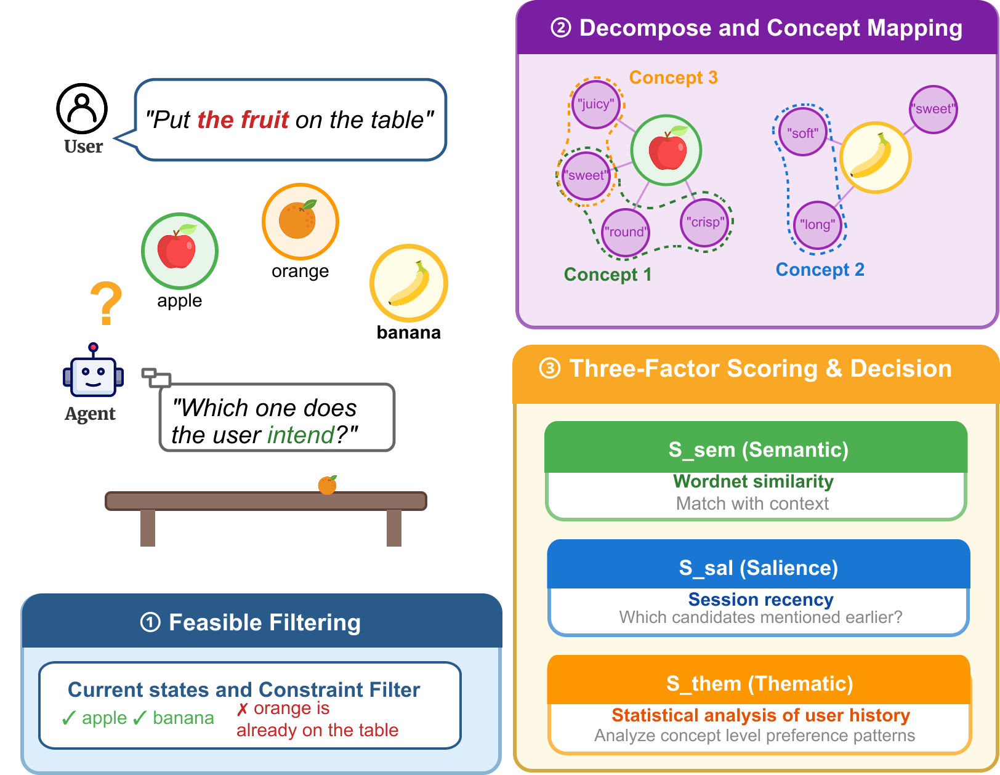
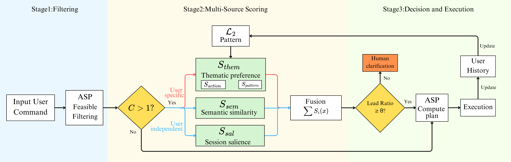
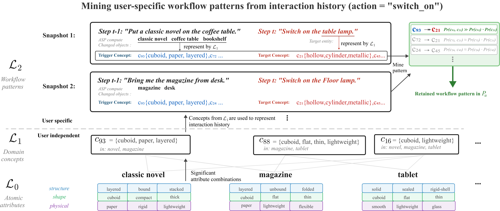

# Robot Assistant Framework

## Figures





## Quick Setup
**Requirements**: Python 3.8+
1. Install dependencies:

```bash
pip install -r requirements.txt
```

2. Set OpenAI API key:

```bash
export OPENAI_API_KEY="your_api_key"
```

## Run Modes

1. Single target test (one file only):

```bash
python test_fuzzy_sets.py --target user1_health_l1.txt
```

2. Interactive/debug run:

```bash
python main.py
```

